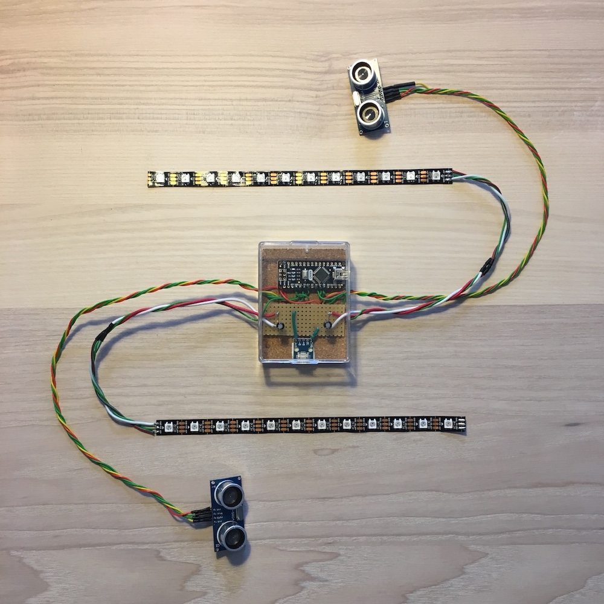
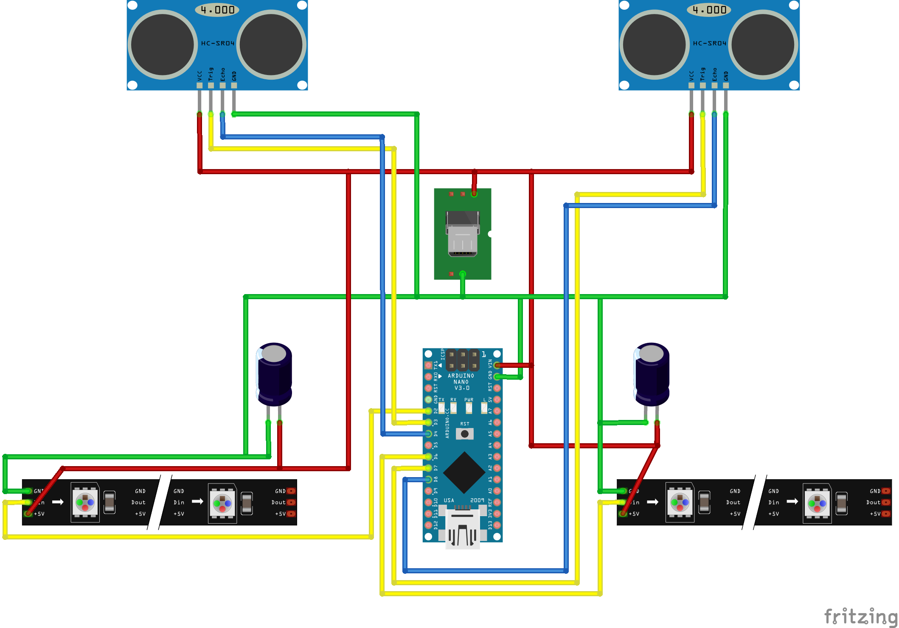

# Two side strip lights

LED light strips with ultrasonic brightness controls.

## Features

- Two independent LED strips
- Brightness controls via ultrasonic sensors

## Development

Requires assembled hardware ([see below](#Hardware)) and [PlatformIO](https://platformio.org).

1. Adjust ports in ``platformio.ini``
1. Adjust pins, number of LED pixels and color settings depending on your needs in ``src/main.cpp``.
1. Flash device

### Dependencies

Required libraries:

- Adafruit NeoPixel
- Bifrost library for HC-SR04
- Low-Power

## Deployment

See (development section above)[#Development].

## Hardware

### Parts

- Arduino Nano v3/Mini/Uno/...
- 2&times; 100µF capacitors
- 2&times; NeoPixel LED strips with 12 pixels (WS2812B)
- USB Micro Plug
- Wires
- Plastic case
- USB cable (USB A to micro)
- Power supply (>= 2.5A, depends on the number of pixels of your LED strips)

### Wiring

[See Fritzing Sketch](docs/Wiring.fzz).

